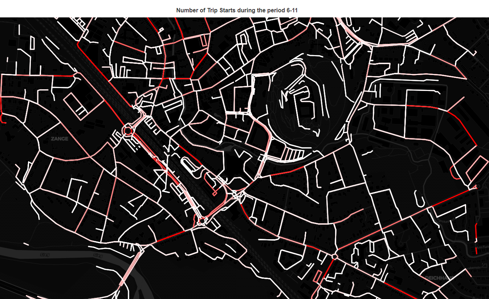
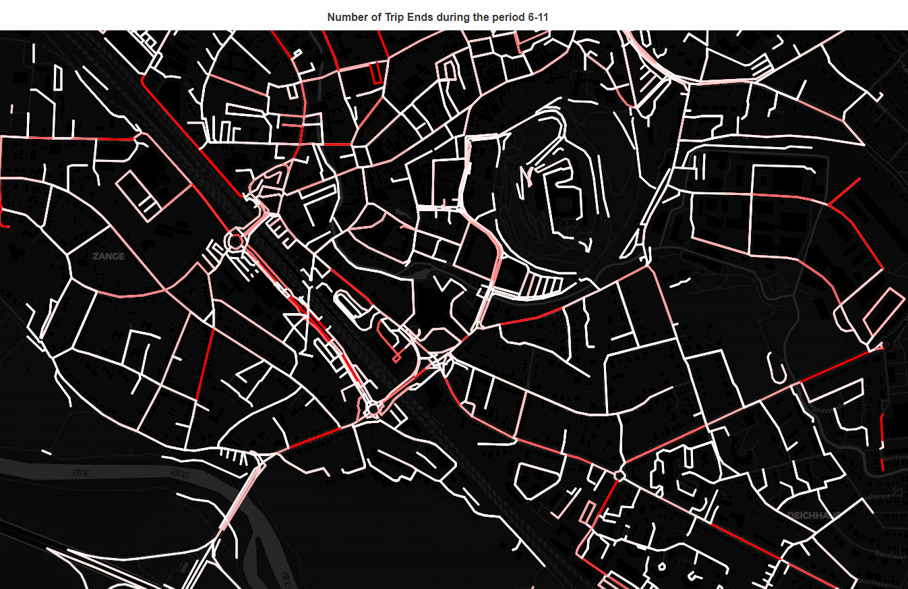

# Questions to Explore

## Client Questions
- Monitor the traffic through Zeithstraße
- Traffic around schools at 8am. Traffic trends related to "Elterntaxis"?
- Speed limits in front of Kindergardens. Are they followed?

## Understand Land use relative to transport
- Where do trips start and end?
- For each hour of the day, which streets are destinations, which are origins?
In this map trips are grouped into 6-hour windows (i.e. 0-6, 7-12, 13-18, 19-23). The code can be modified to use sliders to switch between start/end or time window.

    - ToDo: Separate weekday/weekend?
    - Why this is better than a heat map?: The street data from OSM has additional info like speed limits, direction, etc.
- which points of interest can be found near these start and end spots?

## Reduce Congestion
- Where are the congested zones? What time are they congested? Plot routes which pass through congested zones. Can they be diverted?
- Do the different weight classes have similar congestion zones?

## Reduce car use 
- Compare each trip to the shortest distance. How many trips are far less efficient than the shortest path?
- Which trips could have been replaced by public transport
- Which trips could have been replaced by cycling?